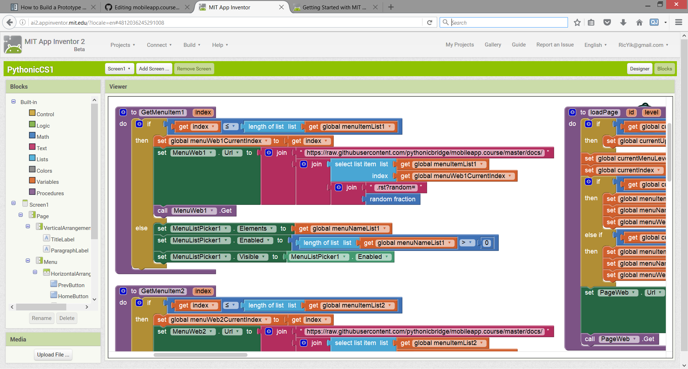

Building Logic with App Inventor Blocks View
============================================

Then you may define the workflow and UI behavior of our app in Blocks view. App Inventor allows you to build your program visually by buliding blocks. If you come with no programmng background and would need more walkthough you may check out `this tutorial <http://appinventor.mit.edu/explore/get-started.html>`_ and continuue.
