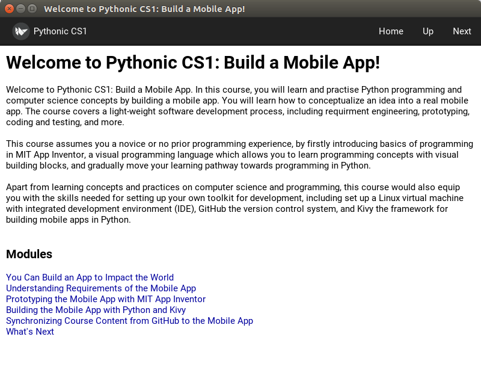

Building the Mobile Learning App in Python and Kivy
===================================================

Let's back to to our focus on building a mobile learning app. Recapping what we have prototyped, we are building a mobile learning app which allows contributor to create / modify content via Git / GitHub. And the content can be sycnrhonized automatically to ReadTheDocs as well as our mobile learning app. Let's learn it by doing it.

Step 1: Fork the Starter Code into Your GitHub Account
~~~~~~~~~~~~~~~~~~~~~~~~~~~~~~~~~~~~~~~~~~~~~~~~~~~~~~

#. Please fork from `this URL <https://github.com/pythonicbridge/mobileapp.kivy>`_. Please refer to the previous sections if you are not sure how to do it.

Step 2: Clone to PyCharm
~~~~~~~~~~~~~~~~~~~~~~~~

#. Like what we did previously. Please refer to the previous document for details.

Step 3: Switch to 0.1.0 Branch
~~~~~~~~~~~~~~~~~~~~~~~~~~~~~~

Please type the following. We will explain why we need to do that in the next module.

.. code::

  git checkout release/0.1.0

Step 4: Run the Starter Code
~~~~~~~~~~~~~~~~~~~~~~~~~~~~

#. By locating main.py and run it. You should see a screen like this:

Let's discuss this screen in details in the next section.
