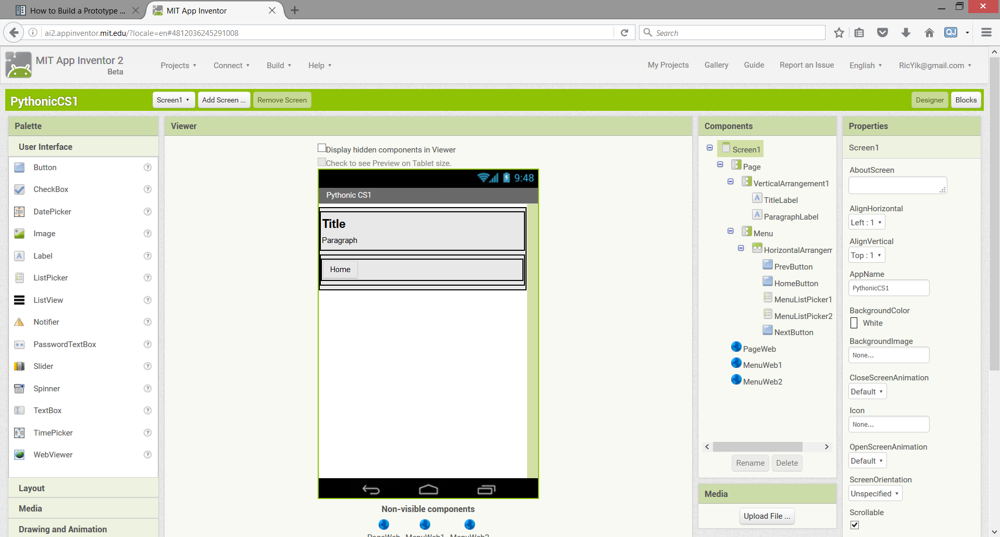

Designing UI with App Inventor Designer View
============================================

Let's take a look at how you can build your first prototype UI with App Inventor. In App Inventor, you design your UI via a drag-and-drop UI builder namely Designer View. From the left of the screen we have dragged several Labels and Buttons with different format and position. You can design your UI very intuitively with a very shallow learning curve. Check out `User Interface Components <http://ai2.appinventor.mit.edu/reference/components/userinterface.html>`_ for details.
