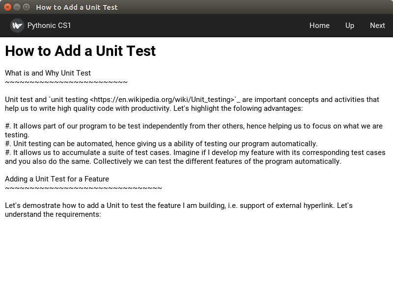
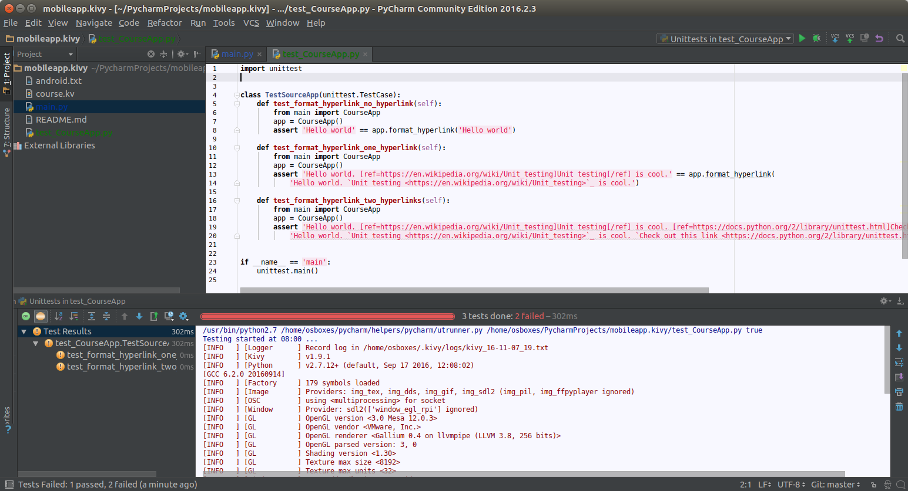
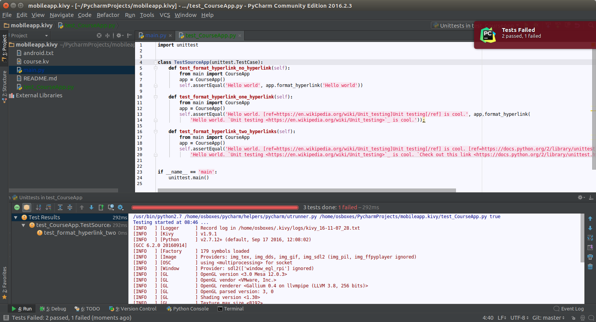
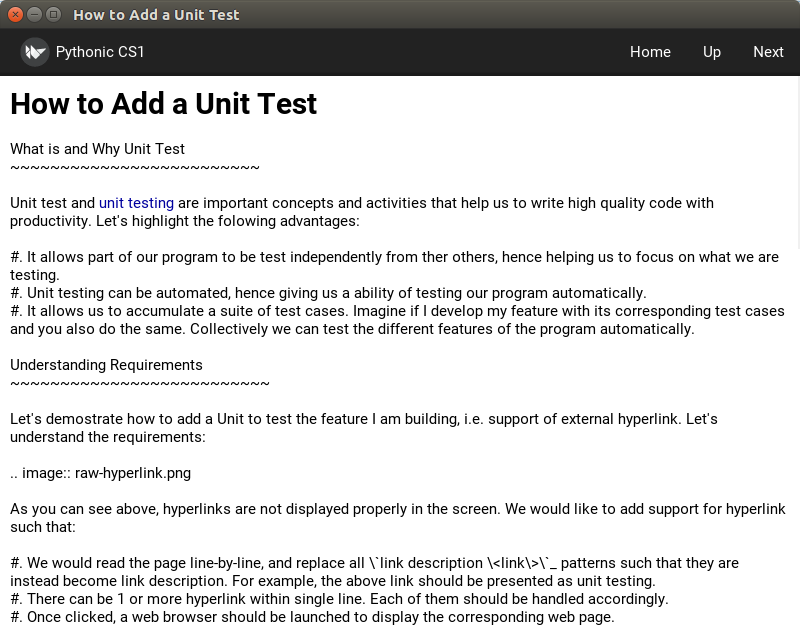

How to Add a Unit Test
======================

What is and Why Unit Test
~~~~~~~~~~~~~~~~~~~~~~~~~

Unit test and `unit testing <https://en.wikipedia.org/wiki/Unit_testing>`_ are important concepts and activities that help us to write high quality code with productivity. Let's highlight the folowing advantages:

#. It allows part of our program to be test independently from ther others, hence helping us to focus on what we are testing.
#. Unit testing can be automated, hence giving us a ability of testing our program automatically.
#. It allows us to accumulate a suite of test cases. Imagine if I develop my feature with its corresponding test cases and you also do the same. Collectively we can test the different features of the program automatically.

Understanding Requirements
~~~~~~~~~~~~~~~~~~~~~~~~~~

Let's demostrate how to add a Unit to test the feature I am building, i.e. support of external hyperlink. Let's understand the requirements:

As you can see above, hyperlinks are not displayed properly in the screen. We would like to add support for hyperlink such that:

#. We would read the page line-by-line, and replace all \`link description \<link\>\`_ patterns such that they are instead become [ref=link]link description[/ref]. For example, the above link should be presented as [ref=https://en.wikipedia.org/wiki/Unit_testing]unit testing[/ref].
#. There can be 1 or more hyperlink within single line. Each of them should be handled accordingly.
#. Once clicked, a web browser should be launched to display the corresponding web page.

Let's add a Unit Test for parsing and formatting the hyperlink as required above. We will leave launching a web browser to be done in the next module.

Adding Unit Test with Pycharm
~~~~~~~~~~~~~~~~~~~~~~~~~~~~~

#. Add a method format_hyperlink(self, line) inside CourseApp class. For now, let's simply add return line as its implementation.
#. Add a file test_CourseApp.py. It should look like this. Press ALT-SHIFT-10 to run it.

As you can see. Pycharm will show you how many test cases are you passing / failing. In this case, as we haven't implement anything yet in our format_hyperlink(self, line) function, it is expected that we have failing cases. Here we are demostrating one important feature on how unit test can be used to drive our development effort that:

#. Before startng writing code, write test which fail first.
#. Make change to pass tests.
#. Repeat until you have passed all tests.

In later modules, you will see how we make use of unit testing to not just improve the correctness of our code, but also improve the quality of our code. We collectively call this effort a `Test-driven Development (TDD) <https://en.wikipedia.org/wiki/Test-driven_development>`_ methdology. For now, let's focus on writing code to passes all of our test cases first.

Implementing the Function to Pass the Tests
~~~~~~~~~~~~~~~~~~~~~~~~~~~~~~~~~~~~~~~~~~~

Let's try implementing the function like the following:

.. code:: python
  
  def format_hyperlink(self, line):
    return re.sub('`(.*) <([^>]*)>`_', r'[ref=\2]\1[/ref]', line)
    
And run the test again. This time we have passed 2 cases, but leaving 1 case failing:

Now let's fix our code to be the following:

.. code:: python
  
  def format_hyperlink(self, line):
    return re.sub('`([^`]*) <([^>]*)>`_', r'[ref=\2]\1[/ref]', line)

And run the test again. This time we have passed all tests. Cool!

Discussion
~~~~~~~~~~

#. In the implementation above, we are using `Regular Expression <https://docs.python.org/2/library/re.html>`_ module to help us extracting information from a pattern and replacing the matching pattern with the re-formatted information that was extracted previously. You may check out `this video <https://www.youtube.com/watch?v=kWyoYtvJpe4>`_ for a tutorial.
#. Once you have finished, in your own word, can you explain what does teh regular expression do which passes all the tests?
#. Then, in your own word, can you explain why the first attempt does not work for more than 1 hyperlink?

Next
~~~~

So now my feature looks good. I can intrgrate my change to see it in shot:

Next, let's integrate my change back to master.
