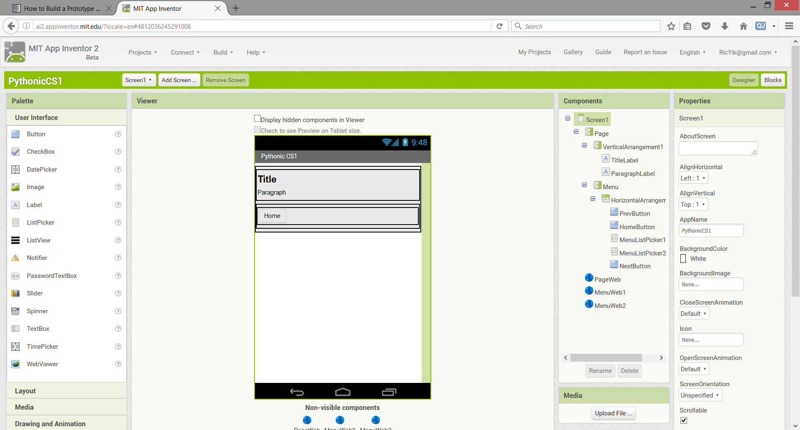
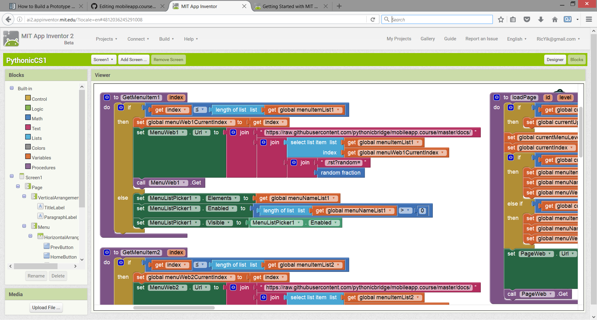

How to Build a Prototype with MIT App Inventor
==============================================

What is MIT App Inventor?
~~~~~~~~~~~~~~~~~~~~~~~~~

MIT App Inventor is a visual UI and programming environment which allow us to build fully functional visual Android application in a short period of time.

What Values Does MIT App Inventor Bring into Our Prototype?
~~~~~~~~~~~~~~~~~~~~~~~~~~~~~~~~~~~~~~~~~~~~~~~~~~~~~~~~~~~

For our context of building our prototype, MIT App Inventors provides the following features which fits our need perfectly to build our prototype.

#. Easy to setup: `Visit here <http://ai2.appinventor.mit.edu/>`_ to start building the UI by drag-and-drop within the web browser.
#. Instant feedback: `Install AI2 Companion <https://play.google.com/store/apps/details?id=edu.mit.appinventor.aicompanion3&hl=en>`_ from Google Play store to try the app instantly while you build the protoype, therefore speeding up the feedback cycle.
#. Connectivity to GitHub: One of the key feature of our mobile app is the ability ot sync up content instantly from GitHub, as well as ability to navigate among pages of these course contents as a graph of interconnected documents. App Inventor has built-in Web connectivity which allows us to download the course content as source file from GitHub and to extract contents / links from it accordingly. This way we can address the feasibility of synchronizing from GitHub as early as possible.

Designing UI with App Inventor Designer View
~~~~~~~~~~~~~~~~~~~~~~~~~~~~~~~~~~~~~~~~~~~~

Let's take a look at how you can build your first prototype UI with App Inventor. In App Inventor, you design your UI via a drag-and-drop UI builder namely Designer View. From the left of the screen we have dragged several Labels and Buttons with different format and position. You can design your UI very intuitively with a very shallow learning curve. Check out `User Interface Components <http://ai2.appinventor.mit.edu/reference/components/userinterface.html>`_ for details.

Building Logic with App Inventor Blocks View
~~~~~~~~~~~~~~~~~~~~~~~~~~~~~~~~~~~~~~~~~~~~

Then you may define the workflow and UI behavior of our app in Blocks view. App Inventor allows you to build your program visually by buliding blocks. If you come with no programmng background and would need more walkthough you may check out `this tutorial <http://appinventor.mit.edu/explore/get-started.html>`_ and continuue.

Playing Around the Working Prototype
~~~~~~~~~~~~~~~~~~~~~~~~~~~~~~~~~~~~

To speed you up we have built a working prototype in `this location <http://ai2.appinventor.mit.edu/?galleryId=5590318435794944>`_. Once you have opened it and launched it in your Android phone, you would see the following screen:

This screen is generated by parsing and extracting infromation from the course `source file hosted in GitHub <https://raw.githubusercontent.com/pythonicbridge/mobileapp.course/master/docs/index.rst>`_. User may click on the Next button to move to the next page. Alternatively, he / she can click on the Module button to show the module list like below.

.. image:: prototype-01-module.jpeg

Questions / Exercise for You
~~~~~~~~~~~~~~~~~~~~~~~~~~~~

Please try the following exercises to faciliate your learning:

#. Try testing the app by clicking the Next button in the mobile app, and check if the corresponding Next page is shown. As a cross-check you can refer to this course web site. The Next button in the mobile app and the course web site should be the same.
#. Open the blocks view for the mobile app, can you locate the logic for deciding which page is the next page?
#. Based on what you have observed by testing and readind the code, in your own words, can you describe the algorithm of deciding which page is the next page?
#. Visit the `Tree Traversal Wikipedia Page <https://en.wikipedia.org/wiki/Tree_traversal>`_. Do you think our logic for deciding the next page is better to be described as Breath-first or Depth-first? Is the logic traversing by pre-order, in-order, or post-order?
#. As a `Minimum Viable Product <https://en.wikipedia.org/wiki/Minimum_viable_product>`_, we have chosen not to implement logic for displaying image as well as support for Prev button. As a programming exercise, can you help implementing them? You may start from `this location <http://ai2.appinventor.mit.edu/?galleryId=5590318435794944>`_ for the starter code and remix it on your own.
