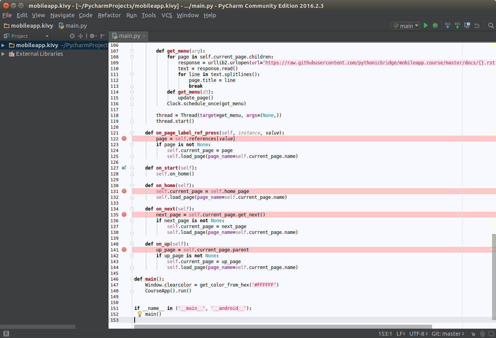

Understanding Events in the Mobile Learning App
===============================================

.. image:: pythonic-cs1-kivy.png

The mobile learning app fetch the course content from GitHub and present it to the user. Navigation menu including Home, Up, and Next are working the similar way like our Prototype. Unlike the prototype, as `Kivy label supports ref and other markups <https://kivy.org/docs/api-kivy.core.text.markup.html>`_, we can embed the menu directly into the document such that it looks more natural.

Whenever user clics on either the navigation menu or the menu, Kivy would send an event as a function call to our Python code. To understand what does that mean, let's try `adding breakpoints <https://www.jetbrains.com/help/pycharm/2016.1/using-breakpoints.html>`_ into our program.

In general, breakpoint can be added by clicking the line number which you want your program to be paused when it reaches that line. Let's trying adding breakpoints like the screen below:

Then press ALT-SHIFT-F9 to start debugging the app. You will see the breakpoint will stop at on_home() function. You can inspect memory, and carry on execution by pressing F6 for next statement, F5 to getting into a function, F7 to getting out from a function, F8 to continue.

Questions / Exercise for You
~~~~~~~~~~~~~~~~~~~~~~~~~~~~

#. Which function will be triggered when you click on a ref? Can you add a watch to look at the variable "value"?
#. Which function will be triggered when you click on the Home button? How about the Up button and the Next button?
#. Open course.kv. Based on the experience from the first 2 points, can you locate how does `event bindings are defined in Kivy Language <https://kivy.org/docs/guide/lang.html>`_?
#. Additional reading: `Kivy Events and Properties <https://kivy.org/docs/guide/events.html>`_

Next Steps
~~~~~~~~~~

Well done. Now you have learnt a lot how to get started in PyCharm to develop our mobile learning app. In the next modules, you will learn how to add additional functionalities into our app. You will start writing some Python code to make the app to be even better. Stay tuned :)
