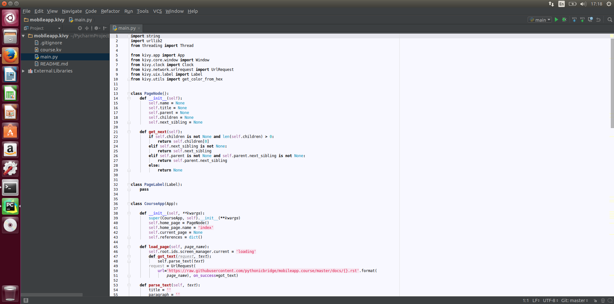
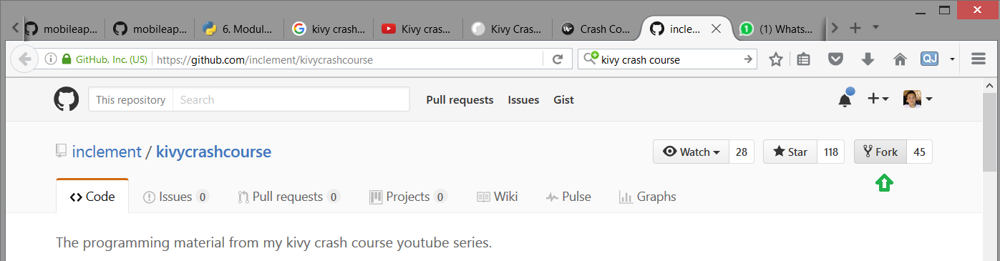
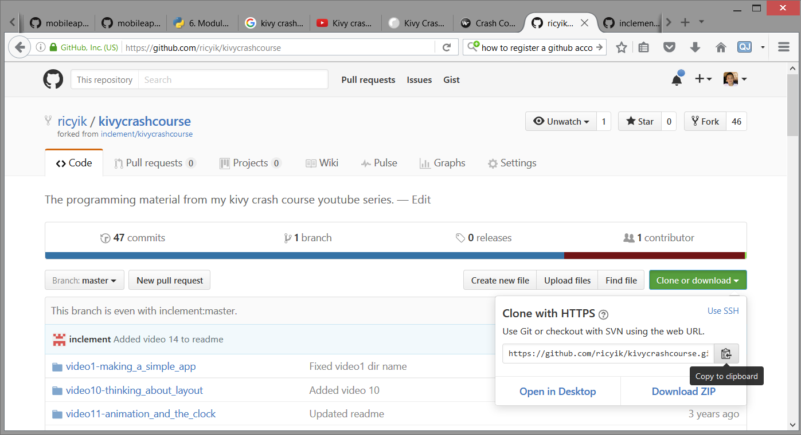
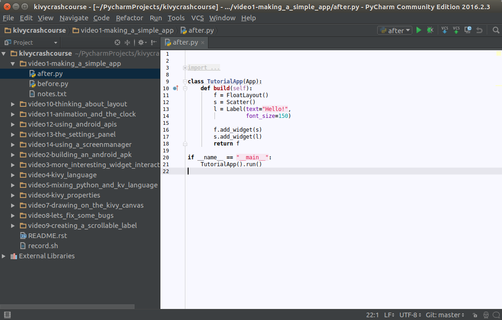
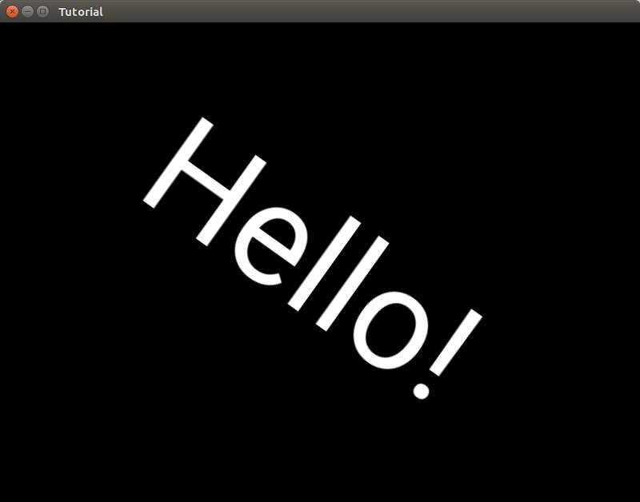

Working with Pycharm IDE, Git, and Kivy
=======================================

What is Pycharm
~~~~~~~~~~~~~~~

Pycharm is a Python Integrated Development Environemnt which streamlines your development, testing, debugging, and version control experience. Altnhough you can watch this `Pycharm IDE Video Tutorial <https://www.youtube.com/watch?v=BPC-bGdBSM8&list=PLQ176FUIyIUZ1mwB-uImQE-gmkwzjNLjP>`_ to see how Pycharm can help you, let's again get the hand dirty by working out the following tutorial :)

Launching Pycharm
~~~~~~~~~~~~~~~~~

#. Open a terminal.
#. Run the following command.

.. code::

  ~/pycharm/bin/pycharm.py
  
Pycharm IDE: Look and Feel
~~~~~~~~~~~~~~~~~~~~~~~~~~

Your usual PyCharm setup would look like this. In short, you have a list of files in your project on the left hand side, and opened files on the right hand side. You may create / edit Python code and auto-code completion would happen like other IDEs. Alternatively, you can press CTRL-SPACE to force auto-code completion dialog to be shown if it doesn't.

Sometimes, you may typed some code which cause compilation error. For insance, you are `using a class but forget to import it <https://docs.python.org/2/tutorial/modules.html>`_ into your source. Then you may try pressing ALT-ENTER and Pycharm would attempt fixing this for you.

Sometimes, you would like to `override a function <https://en.wikipedia.org/wiki/Method_overriding#Python>`_ which has been defined in the base class. You may press ALT-INSERT to help you choosing the function which you want to override. Pycharm will then fill in the function signature for you.

Let's Play Around PyCharm, Git / GitHub, and Kivy Together!
~~~~~~~~~~~~~~~~~~~~~~~~~~~~~~~~~~~~~~~~~~~~~~~~~~~~~~~~~~~

If you still remmeber, in the previous setup page you have not only installed PyCharm IDE, but also Git and Kivy. Let's also play around them a bit to know how things are working together.

Step 1: Forking a Project into Your GitHub Account
~~~~~~~~~~~~~~~~~~~~~~~~~~~~~~~~~~~~~~~~~~~~~~~~~~

To get started using Git and GitHub. You need a GitHub account. 

#. `Create a GitHub account <https://github.com/join>`_ if you do not have one.
#. Visit `Kivy Crash Course <https://github.com/inclement/kivycrashcourse>`_ and press the Fork button.

Step 2: Clone the Forked Project into Your Machine via PyCharm IDE
~~~~~~~~~~~~~~~~~~~~~~~~~~~~~~~~~~~~~~~~~~~~~~~~~~~~~~~~~~~~~~~~~~

Now you have `forked a project <https://help.github.com/articles/fork-a-repo/>`_ into your GitHub account. Next step is to clone this project into your local machine. To do this:

#. Follow the steps as mentioned in `here <https://www.jetbrains.com/help/pycharm/2016.1/cloning-a-repository-from-github.html>`_. Locate the kivycrashcourse repo to be cloned into your machine.
#. If it is successful, you should be seeing a screen like the following in step 3.

Step 3: Running Your first Kivy App
~~~~~~~~~~~~~~~~~~~~~~~~~~~~~~~~~~~

At this point your have setup yout PyCharm environemnt together with the Kivy Crash Course. While you may `watch the video <https://www.youtube.com/playlist?list=PLdNh1e1kmiPP4YApJm8ENK2yMlwF1_edq>`_ for the full crash course, you may run your own copy of Kivy app. Here is how to do it:

#. Open after.py like the screen above.
#. Press ALT-SHIFT-F10 to run the program. Note at the 1st attempt PyCharm may be processing in background such that you cannot run the app until it has finish. You can find out PyCharm's progress by looking at the lower right corner of the screen. Be patient and run again after it has finished.
#. If you can see a new window like below, that means you have setup the things you need to start building app in PyCharm and Kivy. Well done!

